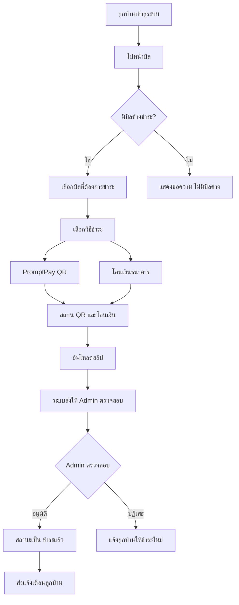
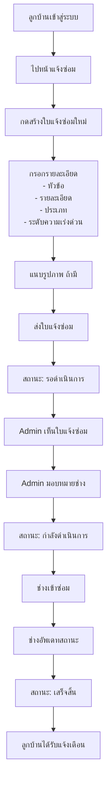
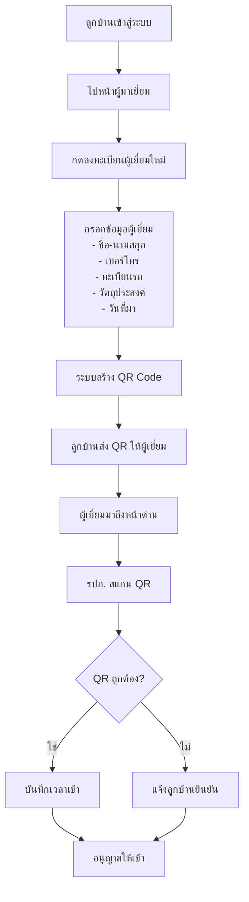
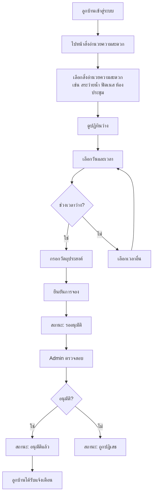
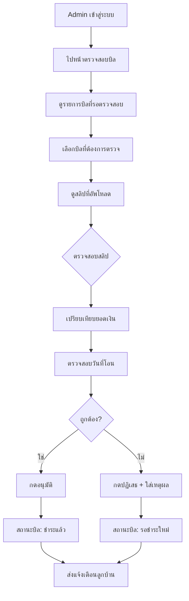
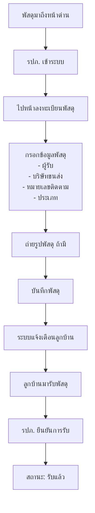
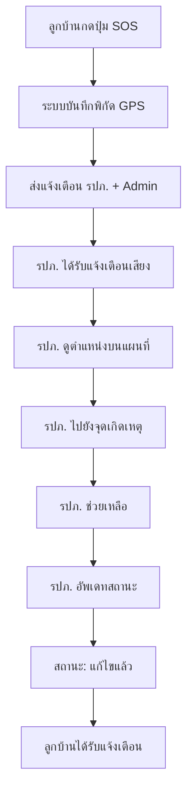
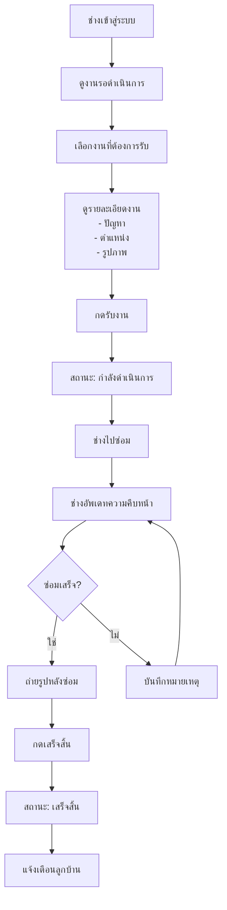

# 🏘️ My Village - ระบบจัดการหมู่บ้านอัจฉริยะ

> ระบบจัดการหมู่บ้านและคอนโดมิเนียมแบบครบวงจร พัฒนาด้วย Next.js 16

[]()
[]()
[]()
[]()

---

## 📋 สารบัญ

- [ภาพรวม](#-ภาพรวม)
- [เทคโนโลยี](#-เทคโนโลยี)
- [การติดตั้ง](#-การติดตั้ง)
- [บทบาทผู้ใช้](#-บทบาทผู้ใช้)
- [Flow ฟีเจอร์แต่ละ Role](#-flow-ฟีเจอร์แต่ละ-role)
- [โครงสร้างโปรเจค](#-โครงสร้างโปรเจค)
- [API Documentation](#-api-documentation)

---

## 🏠 ภาพรวม

**My Village** คือระบบจัดการหมู่บ้านที่ครอบคลุมทุกความต้องการ:

- 🏢 **จัดการลูกบ้าน** - ข้อมูลผู้พักอาศัยทั้งหมด
- 📢 **ประกาศข่าวสาร** - แจ้งข่าวถึงลูกบ้านแบบ Real-time
- 📦 **จัดการพัสดุ** - รับ-ส่งพัสดุพร้อมแจ้งเตือน
- 🔧 **ระบบแจ้งซ่อม** - แจ้งปัญหาและติดตามสถานะ
- 👥 **ผู้มาติดต่อ** - ลงทะเบียน + QR Code
- 💰 **ชำระค่าบริการ** - PromptPay/โอนเงิน + อัพโหลดสลิป
- 🏊 **จองสิ่งอำนวยความสะดวก** - ห้องประชุม สระว่ายน้ำ ฟิตเนส
- 🎫 **ติดต่อนิติบุคคล** - ระบบ Ticket Support
- 🚨 **แจ้งเหตุฉุกเฉิน** - ปุ่ม SOS พร้อม GPS

---

## ⚙️ เทคโนโลยี

| หมวด | เทคโนโลยี |
|------|-----------|
| **Framework** | Next.js 16.1.0 (Turbopack) |
| **Frontend** | React 19 + TypeScript 5.7 |
| **Styling** | TailwindCSS 4 + shadcn/ui |
| **Database** | PostgreSQL (Neon) + Drizzle ORM |
| **API** | Elysia.js + Eden Treaty |
| **Authentication** | Auth.js v5 |
| **File Upload** | Cloudinary |
| **QR Code** | qrcode + html5-qrcode |
| **Export** | xlsx + jspdf |
| **Testing** | Vitest (159 tests) + Playwright |

---

## 🚀 การติดตั้ง

### ความต้องการ
- Bun 1.3.4+
- PostgreSQL (Neon)

### ขั้นตอน

```bash
# Clone โปรเจค
git clone https://github.com/your-repo/village-app.git
cd village-app

# ติดตั้ง dependencies
bun install

# ตั้งค่า environment
cp .env.example .env.local
# แก้ไข DATABASE_URL และ AUTH_SECRET

# สร้างฐานข้อมูล
bun db:push

# รันโปรเจค
bun dev
```

### Scripts ที่มี

```bash
bun dev           # รัน development server
bun build         # Build production
bun test          # Run tests (159 tests)
bun e2e           # Run E2E tests
bun db:studio     # เปิด Drizzle Studio
```

---

## 👥 บทบาทผู้ใช้

### 🏠 ลูกบ้าน (Resident)
ผู้พักอาศัยในหมู่บ้าน สามารถใช้บริการต่างๆ ได้

| ฟีเจอร์ | คำอธิบาย | หน้า |
|--------|---------|------|
| แดชบอร์ด | ภาพรวมข้อมูลส่วนตัว | `/resident` |
| ดูประกาศ | อ่านข่าวสารจากนิติ | `/resident/announcements` |
| ดู/ชำระบิล | ชำระค่าส่วนกลาง | `/resident/bills` |
| แจ้งซ่อม | แจ้งปัญหาในห้อง | `/resident/maintenance` |
| ดูพัสดุ | ตรวจสอบพัสดุที่มาถึง | `/resident/parcels` |
| จัดการผู้เยี่ยม | ลงทะเบียนแขก + QR | `/resident/visitors` |
| จองสิ่งอำนวยความสะดวก | จองห้อง/สระ/ฟิตเนส | `/resident/facilities` |
| ติดต่อนิติ | ส่ง Ticket | `/resident/support` |
| ตั้งค่า | การแจ้งเตือน/ความเป็นส่วนตัว | `/resident/settings` |

---

### 🏢 ผู้ดูแลระบบ (Admin)
เจ้าหน้าที่นิติบุคคล ดูแลจัดการระบบทั้งหมด

| ฟีเจอร์ | คำอธิบาย | หน้า |
|--------|---------|------|
| แดชบอร์ด | สถิติภาพรวม | `/admin` |
| จัดการประกาศ | CRUD ประกาศ | `/admin/announcements` |
| จัดการลูกบ้าน | CRUD ผู้พักอาศัย | `/admin/residents` |
| จัดการบิล | สร้าง/ตรวจสอบบิล | `/admin/bills` |
| ตั้งค่าการชำระ | PromptPay/บัญชีธนาคาร | `/admin/payment-settings` |
| แจ้งซ่อม | ดูและมอบหมายงาน | `/admin/maintenance` |
| จัดการสิ่งอำนวยความสะดวก | CRUD + ตารางจอง | `/admin/facilities` |
| ดู SOS | รับแจ้งเหตุฉุกเฉิน | `/admin/sos` |
| รายงาน | ดู/ส่งออก Excel/PDF | `/admin/reports` |

---

### 👮 รปภ. (Security)
เจ้าหน้าที่รักษาความปลอดภัย ดูแลประตูทางเข้า

| ฟีเจอร์ | คำอธิบาย | หน้า |
|--------|---------|------|
| แดชบอร์ด | สถิติวันนี้ | `/security` |
| ลงทะเบียนผู้เยี่ยม | บันทึกแขกเข้าหมู่บ้าน | `/security/visitors/new` |
| สแกน QR | ตรวจสอบ QR ผู้เยี่ยม | `/security/scan` |
| รับพัสดุ | บันทึกพัสดุที่มาถึง | `/security/parcels` |
| ดู SOS | รับแจ้งเหตุฉุกเฉิน | `/security/sos` |
| แจ้งเตือนฉุกเฉิน | กดแจ้งเหตุด่วน | `/security/emergency` |

---

### 🔧 ช่างซ่อมบำรุง (Maintenance)
เจ้าหน้าที่ซ่อมบำรุงประจำหมู่บ้าน

| ฟีเจอร์ | คำอธิบาย | หน้า |
|--------|---------|------|
| แดชบอร์ด | งานที่ได้รับมอบหมาย | `/maintenance` |
| งานรอดำเนินการ | งานใหม่ที่ยังไม่รับ | `/maintenance/pending` |
| งานกำลังทำ | งานที่กำลังดำเนินการ | `/maintenance/in-progress` |
| งานเสร็จแล้ว | ประวัติงานที่ทำเสร็จ | `/maintenance/completed` |
| อุปกรณ์ | จัดการอุปกรณ์ซ่อม | `/maintenance/equipment` |
| สถิติ | ผลงานและประสิทธิภาพ | `/maintenance/analytics` |

---

### 👨‍💼 Super Admin
ผู้ดูแลระบบระดับสูง ดูแลหลายโปรเจค

| ฟีเจอร์ | คำอธิบาย | หน้า |
|--------|---------|------|
| แดชบอร์ด | ภาพรวมทุกโปรเจค | `/super-admin` |
| จัดการโปรเจค | CRUD หมู่บ้าน/คอนโด | `/super-admin/projects` |
| จัดการผู้ใช้ | Admin ทุกโปรเจค | `/super-admin/users` |
| สิทธิ์การเข้าถึง | RBAC | `/super-admin/permissions` |
| ฐานข้อมูล | จัดการ DB | `/super-admin/database` |
| Audit Logs | ประวัติการเปลี่ยนแปลง | `/super-admin/audit` |

---

## 🔄 Flow ฟีเจอร์แต่ละ Role

### 🏠 ลูกบ้าน - ชำระค่าส่วนกลาง



---

### 🏠 ลูกบ้าน - แจ้งซ่อม



---

### 🏠 ลูกบ้าน - ลงทะเบียนผู้มาเยี่ยม



---

### 🏠 ลูกบ้าน - จองสิ่งอำนวยความสะดวก



---

### 🏢 Admin - ตรวจสอบการชำระเงิน



---

### 👮 รปภ. - รับพัสดุ



---

### 👮 รปภ. - รับแจ้ง SOS



---

### 🔧 ช่าง - รับงานซ่อม



---

## 📁 โครงสร้างโปรเจค

```
village-app/
├── app/
│   ├── (auth)/                 # หน้า Authentication
│   │   ├── login/              # เข้าสู่ระบบ
│   │   ├── register/           # ลงทะเบียน
│   │   ├── forgot-password/    # ลืมรหัสผ่าน
│   │   ├── reset-password/     # รีเซ็ตรหัสผ่าน
│   │   └── verify-email/       # ยืนยันอีเมล
│   │
│   ├── (dashboard)/            # หน้าหลังเข้าสู่ระบบ
│   │   ├── admin/              # 🏢 หน้า Admin (10 หน้า)
│   │   ├── resident/           # 🏠 หน้าลูกบ้าน (10 หน้า)
│   │   ├── security/           # 👮 หน้า รปภ. (7 หน้า)
│   │   ├── maintenance/        # 🔧 หน้าช่าง (16 หน้า)
│   │   └── super-admin/        # 👨‍💼 หน้า Super Admin (8 หน้า)
│   │
│   └── api/                    # Elysia API
│       ├── [[...slugs]]/       # API Routes (46+ endpoints)
│       ├── auth/               # NextAuth
│       ├── health/             # Health Check
│       └── upload/             # File Upload
│
├── components/
│   ├── ui/                     # shadcn/ui (อย่าแก้ไข!)
│   ├── shared/                 # Components ที่ใช้ร่วมกัน
│   ├── dashboard/              # Components เฉพาะ Dashboard
│   └── layouts/                # Layout Components
│
├── lib/
│   ├── db/                     # Drizzle ORM
│   │   ├── index.ts            # Database connection
│   │   └── schema.ts           # Database schema (14 tables)
│   ├── services/               # Business Logic
│   ├── middleware/             # Audit + Soft Delete
│   └── utils/                  # Utilities
│       └── export.ts           # Export Excel/PDF
│
├── __tests__/                  # Unit Tests
├── e2e/                        # E2E Tests (Playwright)
└── docs/                       # Documentation
```

---

## 📚 API Documentation

เปิด `/api/swagger` เพื่อดู Swagger Documentation

### Endpoints หลัก

| Endpoint | Method | คำอธิบาย |
|----------|--------|---------|
| `/api/announcements` | GET/POST | จัดการประกาศ |
| `/api/users` | GET/POST | จัดการผู้ใช้ |
| `/api/bills` | GET/POST | จัดการบิล |
| `/api/visitors` | GET/POST | จัดการผู้เยี่ยม |
| `/api/parcels` | GET/POST | จัดการพัสดุ |
| `/api/maintenance` | GET/POST | จัดการแจ้งซ่อม |
| `/api/facilities` | GET/POST | จัดการสิ่งอำนวยความสะดวก |
| `/api/bookings` | GET/POST | จัดการการจอง |
| `/api/sos` | GET/POST | จัดการ SOS |
| `/api/notifications` | GET/POST | จัดการแจ้งเตือน |

---

## 🧪 Testing

```bash
# รัน Unit Tests (159 tests)
bun test

# รัน E2E Tests
bun e2e

# ดู Coverage
bun test:coverage
```

---

## 📝 License

MIT License - ดู [LICENSE](LICENSE) สำหรับรายละเอียด

---

## 👨‍💻 ผู้พัฒนา

พัฒนาด้วย ❤️ by My Village Team
